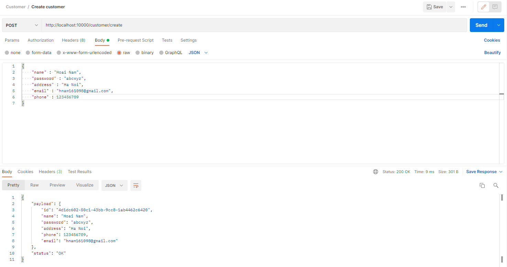
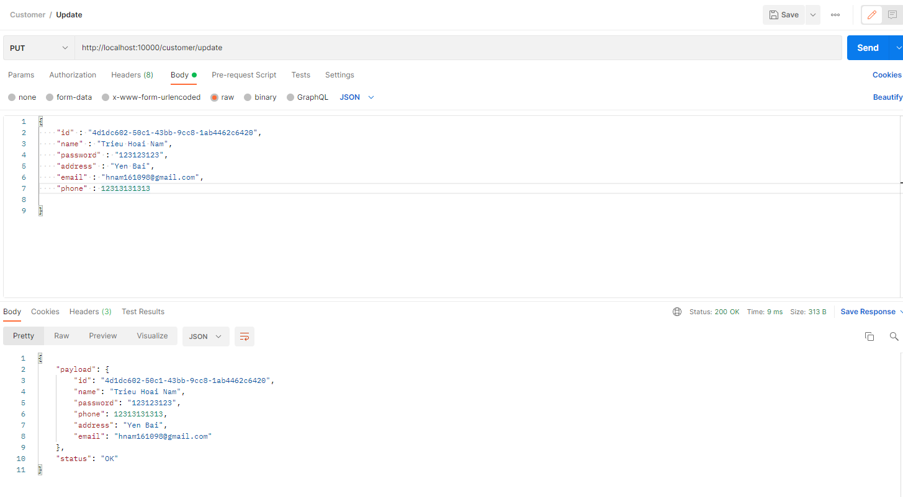
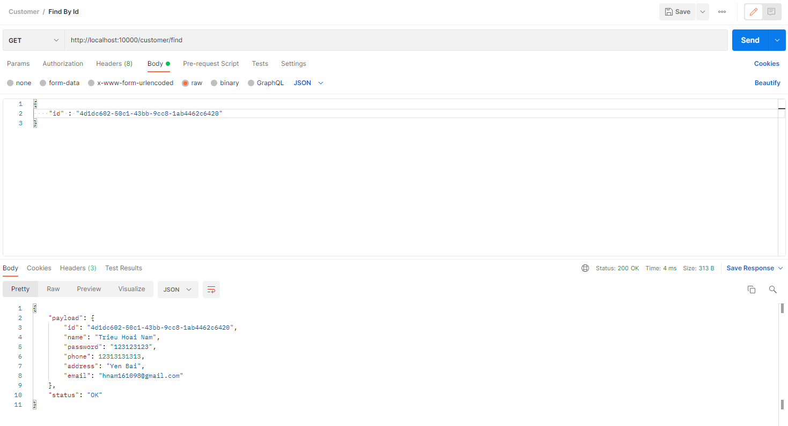
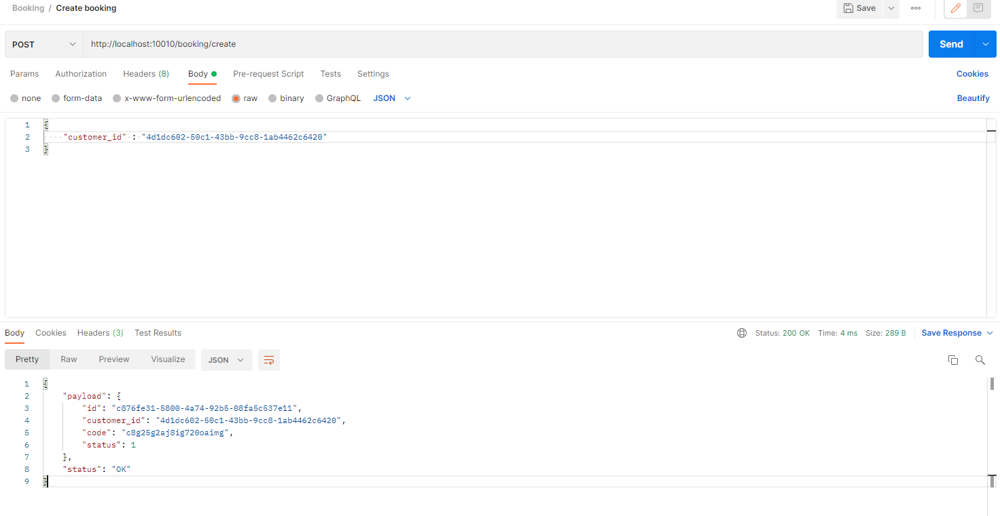
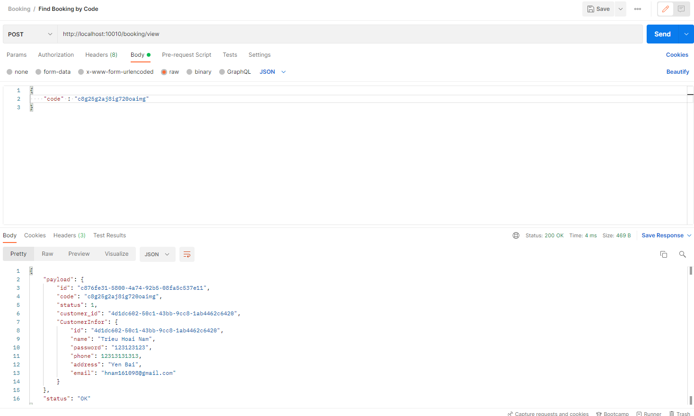
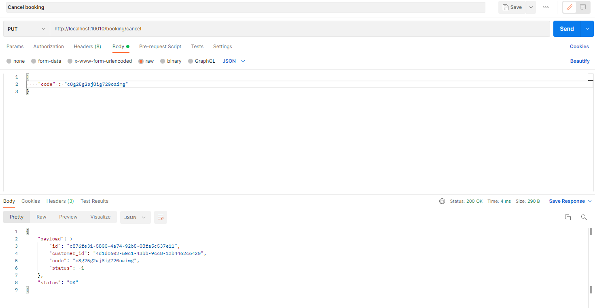

Dự án cá nhân cơ bản mô phỏng về xử lí dữ liệu phía backend của 1 dự án đặt vé máy bay được viết bởi ngôn ngữ Golang theo kiểu Microservice, các service được phân biệt rõ ràng và được tách biệt

Sử dụng: GRPC cho phía xử lí dữ liệu, 
         REST cho phía đầu API để trả về,
         Postgres để lưu trữ dữ liệu,
         GORM cho việc thao tác đến cơ sở dữ liệu,

# CUSTOMER
### Create Customer

### Update Customer

### Find Customer

# Booking
### Create Booking

### Find Booking By Code

### Cancel Booking
